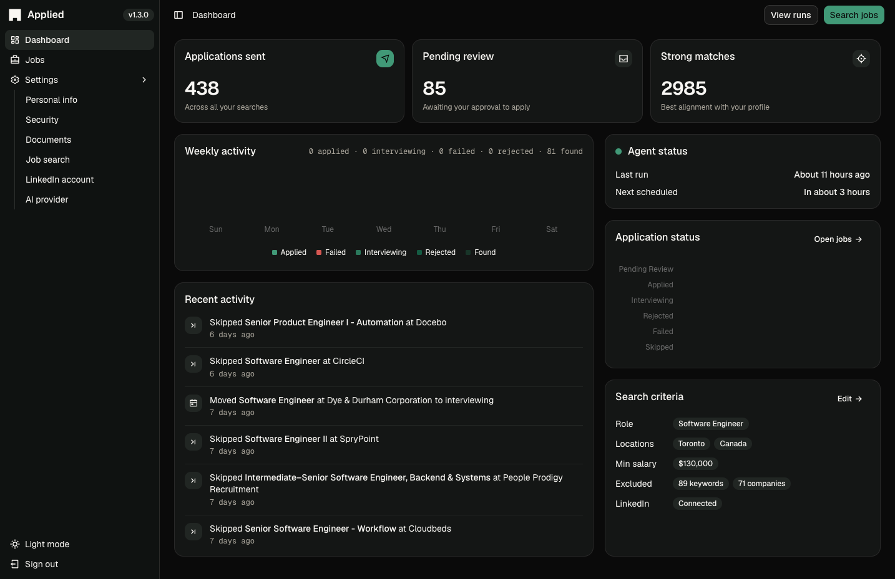

<div align="center">
  <picture>
    <source media="(prefers-color-scheme: dark)" srcset="apps/web/public/lockup-on-dark.svg">
    
  </picture>

  <p>Automated job application tool — find, score, and apply to LinkedIn positions hands-free.</p>
</div>

## Why this exists

Job hunting on LinkedIn usually means running the same search every day, scrolling through every result by hand, and tracking whatever you apply to in a separate spreadsheet. This tool automates that grind, so you can spend the time you get back on the applications that actually matter.

## Key features

- **Smart search** — scrapes LinkedIn for postings matching your target titles, skills, and location preferences
- **LLM scoring** — every job is scored 0–100 against your resume, so you can triage without re-reading each posting
- **Smart deduplication** — skips jobs already in your dashboard by URL, and (if enabled) by matching company + title + location, so re-running a search doesn't flood you with the same postings
- **Filtering** — drops postings that match your excluded keywords or companies
- **Status pipeline** — replaces the spreadsheet: each job starts at `pending_review` and moves to `applied`, `interviewing`, `rejected`, or `skipped` (`applying`/`failed` are set automatically when the AI agent runs)
- **Search + filter + sort** — filter by status or workplace type (on-site/remote/hybrid), search by title/company/location, sort by score or recency
- **Company history** — see how many times you've applied to or been rejected by a company before, and which titles
- **AI application filling** — an agent generates a tailored cover letter and resume PDF, then drives a real browser to fill out and submit each application (LinkedIn Easy Apply, plus external redirects to other ATS platforms) — optional, so you can use this purely as a scraper and tracker and apply yourself
- **Scheduled searches** — run automatically on a daily or weekly cron

## How it works

1. Fill in your profile — target job titles, skills, resume, and location preferences
2. Click **Search Jobs** — the scraper finds matching LinkedIn postings and scores each one
3. Review results in the dashboard — each job is scored 0–100 against your resume by an LLM
4. Select jobs and click **Apply now** — an AI agent fills out and submits each application, generating a personalized cover letter and PDF resume on the fly
5. Optionally configure a schedule to run searches automatically on a daily or weekly cron

<p align="center">
  
</p>

## Getting started

**Prerequisites:** [Docker](https://docs.docker.com/get-docker/) with Compose v2.20+ (ships with Docker Desktop 4.22+)

### 1. Get the compose file

```bash
mkdir applied && cd applied
curl -O https://raw.githubusercontent.com/tonghohin/applied/main/docker-compose.yml
```

### 2. Start it

```bash
docker compose up -d
```

Pulls the published images, starts everything (database, queue, web app, worker), and runs migrations automatically.

### 3. Open the app

Go to [http://localhost:8420](http://localhost:8420), create an account, add your [v0.dev/gateway](https://v0.dev/gateway) AI key under **Settings → AI provider**, then fill in your profile and LinkedIn login.

### Updating

```bash
docker compose pull && docker compose up -d
```

## Contributing

Please read the [contributing guide](CONTRIBUTING.md).

## Disclaimer

This tool automates interactions with LinkedIn in ways that may violate their [User Agreement](https://www.linkedin.com/legal/user-agreement). Use it at your own risk. The authors are not responsible for any consequences including account suspension or legal action.

The AI application filling is still improving, with real limitations worth knowing before you rely on it:

- **Bot detection varies by platform** — some ATS platforms flag or block automated submissions more aggressively than others; a job can fail for this reason alone, independent of your profile or answers
- **Can't handle "create an account first"** — if an application requires signing up for the employer's own portal before you can apply, the agent can't get through that step
- **Not every form is covered** — custom or unusual application forms can trip it up; a failed application shows up as `failed` in your dashboard so you can finish it yourself
